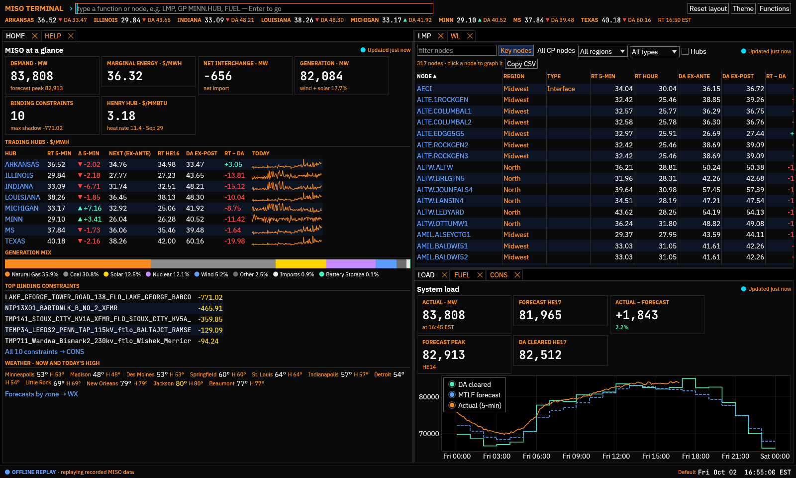
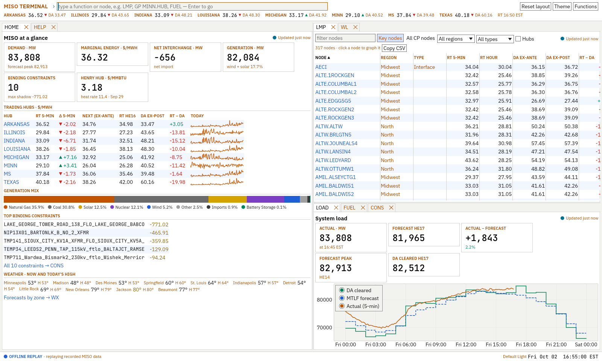

# MISO Terminal

A Bloomberg-style information terminal for the Midcontinent ISO, written in Rust.
It covers prices, load, generation, interchange, constraints, the seams, gas,
weather, the news and the energy stocks beside them in one keyboard-driven, tiled
workspace. It is read-only for MISO: it shows MISO's public data (plus EIA gas
prices, NWS forecasts, publishers' headline feeds and Alpaca's stock and ETF
prices) and never submits anything to MISO. Trading goes only through Alpaca, on
a paper account for now, and every order is checked against your limits and
confirmed on a ticket (see the [markets plan](docs/MARKETS-PLAN.md)).



- **Command line first.** Type `LMP`, `GP MINN.HUB`, `MINN.HUB GP 14`, or just a
  node name, then press Enter. Completion covers every function and every pricing node.
- **Tiled, tabbed workspace.** Drag tabs to split panes, zoom one to the whole
  window (`Ctrl+M`), or pop it out onto a second monitor. Your layout is saved
  between sessions.
- **Live.** Real-time feeds refresh once a minute (MISO's limit). Daily market
  reports are cached on disk, so history loads instantly the second time, and an
  optional local archive reaches back to 2023. Alerts arrive as Windows notifications.
- **Themed.** Ships with **Default** (the trading-desk look: black, orange
  labels, white figures), Default Light and High Contrast. Install more from the
  [gallery](themes/README.md#gallery) in one click inside `THEME`: Catppuccin,
  Everforge, Gruvbox, Monokai, Rosé Pine and Tokyo Night. Drop a TOML file into
  the themes folder to add your own; it hot-reloads while you edit it.
- **Built for Windows.** A single `.exe` with a native window, Windows certificate
  store TLS (corporate proxies work), a per-user or portable data layout and an
  embedded icon. The data, MISO and theme crates also build and test on Linux.

| | |
|---|---|
|  |  |


## Principles

MISO Terminal is a community project, and these hold for every change:

- **Your data stays yours.** No telemetry, no accounts with us, nothing sent
  anywhere but the sources you ask for. Keys and credentials live in Windows
  Credential Manager, never in plain files or logs.
- **Good citizens of the web.** Every source's robots.txt, terms of use and
  rate limits are respected (MISO asks for at most one request a minute per
  feed, and gets it). No scraping around paywalls or limits.
- **Free and open, and kept that way.** Everything here is free, open source
  and shareable. The AGPL-3.0 licence makes sure it stays so: anyone who
  distributes or serves a modified version must share their source too.

## Install (Windows)

Download `miso-terminal-<version>-windows-x64.zip` from the Releases page, unzip
it, and run:

```powershell
powershell -ExecutionPolicy Bypass -File .\install.ps1           # Start Menu shortcut
powershell -ExecutionPolicy Bypass -File .\install.ps1 -Desktop  # plus a desktop shortcut
powershell -ExecutionPolicy Bypass -File .\install.ps1 -Uninstall
```

It installs for the current user only (no administrator rights needed) to
`%LOCALAPPDATA%\Programs\MISO Terminal`. Or skip the script and run
`miso-terminal.exe` straight from the folder; it is a single portable file.

## Build from source (Windows)

```powershell
# Rust stable (https://rustup.rs) and the MSVC build tools are required.
git clone https://github.com/ArenKDesai/miso-terminal
cd miso-terminal
cargo run --release
```

Useful flags:

| Flag | What it does |
|---|---|
| `--offline [DIR]` | Replay the recorded responses in `fixtures/` instead of calling MISO. Use it for demos, UI work, or when MISO is down. |
| `--home DIR` | Portable mode: keep everything in `DIR`. Also enabled by `MISO_TERMINAL_HOME`, or a file named `portable` next to the exe. |
| `--run "CMD"` | Run a command at startup (repeatable), e.g. a desktop shortcut with `--run "GP ALTE.ALTE"`. If the terminal is already open, the command runs in that window instead. |
| `--reset-layout` | Start from the default layout. |
| `--reset-config` | Start from the default settings. `config.toml` is replaced and the old file kept as `config.toml.bak`; API keys and the layout stay. `SET` → *Reset to defaults…* does the same while the terminal runs. |
| `--new-instance` | Open a second window anyway. Normally there is one live window per home, so MISO is polled once. |

Files live in `%APPDATA%\MISO Terminal\config` (config, themes, fonts: these roam)
and `%LOCALAPPDATA%\MISO Terminal` (report cache, logs, the order audit log, window and layout state).
The `LOG` function shows the exact paths and has buttons to open them.

## Functions

New to the terminal? The [tutorials](docs/TUTORIALS.md) walk through the command
line, the workspace, prices and spreads, alerts, the news, stocks, paper trading
and themes.

| Code | Name | What it shows |
|---|---|---|
| `HOME` | Launchpad | Demand, marginal energy cost, interchange, generation, hub prices (RT, next-interval ex-ante, DA) with 5-min sparklines, fuel mix, top constraints, weather and the top stories; with Alpaca keys, the paper account's equity and today's P&L |
| `LMP` | LMP monitor | ~300 key nodes with RT 5-min, RT hourly, DA ex-ante and ex-post, DART, MCC and MLC. Sortable, and filterable by name, region and node type (hub, load zone, interface, generator). `LMP ALL` lists all ~2,600 CP nodes with this hour's DA and RT − DA |
| `HUBS` | Hub statistics | All eight trading hubs over N days: DA, RT and DART averages, on-peak and off-peak blocks, RT volatility, extremes and how often RT beat DA |
| `DAM` | Day-ahead strip | Hourly DA prices at the eight hubs for one day (tomorrow once posted, else today), with on-peak, off-peak and all-hours averages, by component, or as the change from the day before (`DAM TOMORROW`) |
| `MAP` | Price map | Every node MISO plots, over an interpolated price surface of the footprint and the 230 kV-and-up transmission backbone, coloured by RT LMP, congestion, loss, DA or RT − DA. Hover for the breakdown, click to graph |
| `GP` | Graph price | One node: today's 5-min RT vs the DA staircase (plus tomorrow's DA once posted), N days of hourly DA vs RT with stats, an hour × day heatmap (`GP MINN.HUB 14 HEAT`), price duration curves (`… DUR`), or five-minute RT over past days from the local archive (`… 5MIN`). Switch between LMP, energy, congestion and loss. For a security, the latest session minute by minute against the previous close (`GP XLU US`), a few days at 15 minutes (`GP XLU US 5`) or daily closes for up to ten years (`GP XLU US 365`), with volume, in New York time |
| `SPRD` | Node spread | A − B between any two nodes: today at 5 minutes, hourly DA and RT spreads over N days with stats, or five-minute spreads from the archive. Use the congestion component for an FTR-style view |
| `CMP` | Compare | Up to eight nodes on one chart: today's 5-minute RT, or hourly RT or DA over N days, with a latest/average/range row each (`CMP MINN.HUB MICHIGAN.HUB 7`). With securities, their prices (or % change, for several) above the nodes' on one time axis in market time, and how each moved with each node day by day (`CMP XEL US MINN.HUB 30`) |
| `SEAM` | Seams & interfaces | PJM's CTS forecast at the PJM interface against MISO's price there (with the spread and which way it favours flows), and RT and DA prices at all 22 interface nodes (PJM, SPP, TVA, Ontario…) |
| `WL` | Watchlist | Your favourite nodes (RT vs DA, 5-min change, today's sparkline) and securities (last, change, volume, today's chart). Add from here, with `WL <node>` or `WL XLU US`, or with ☆ in GP. Saved to config |
| `ASM` | Ancillary MCPs | Regulation, spinning, supplemental, short-term reserve and ramp MCPs by zone |
| `LOAD` | System load | 5-min actual vs MTLF forecast vs DA cleared, with forecast error |
| `CAP` | Capacity & headroom | Committed capacity vs demand, forecasts, available capacity, real-time RSG commitments and tomorrow's short-term reserve requirement |
| `FUEL` | Fuel mix | Generation by fuel now, plus a stacked chart of the day |
| `GAS` | Natural gas | Henry Hub spot (EIA, no key needed) with its recent change and range, and for each hub the market heat rate and spark spread its DA on-peak price implies (`HH`) |
| `RENEW` | Wind & solar | Hourly forecast vs actual for today and tomorrow, with forecast bias |
| `NSI` | Interchange | Net scheduled interchange by neighbour, actual (metered) interchange and the inadvertent gap, plus 5-min history |
| `RDT` | Regional transfer | North-South regional directional transfer over the last day against its limits, with utilisation |
| `ACE` | Area control error | 30-second ACE over the last two hours: how far generation is from balancing load |
| `WX` | Weather | Now, today's and tomorrow's high/low, dew point, wind and the 48-hour trend for a city in each MISO zone (National Weather Service); hourly chart for all or one |
| `CONS` | Binding constraints | RT binding constraints, shadow prices and how long each has bound; reserve and sub-regional constraints |
| `BCH` | Constraint history | A day's binding constraints in DA and RT side by side, matched by MISO's constraint ID: hours bound, cost ($/MW) and peak shadow price, sortable and filterable, with the selected constraint's DA and RT shadow prices through the day (`BCH 2026-09-30`) |
| `OUT` | Generation outages | Planned, unplanned, forced and derated MW for ±5 days |
| `Q` | Quote monitor | Live prices for a list of stocks and ETFs (Alpaca): last, change, bid and ask, volume, the day's range and today's chart, with every trade streaming (the free plan allows 30 trade and quote subscriptions). `Q` is the Power & gas list (utilities in MISO's footprint, independent generators, energy ETFs, gas producers); also `Q UTILITIES`, `Q GAS`, `Q WL` (your watchlist) or any securities (`Q XEL US AEE US`) |
| `DES` | Security description | What a stock or ETF is and where it lists, how it trades with Alpaca (shortable, marginable, fractional), today's prices, and its 52-week range and returns (`DES XLU US`) |
| `TOP` | Top stories | The newest top stories from the Financial Times, Bloomberg and the Washington Post in one list. Click one for its summary; Enter or a double-click opens the article in your browser, where you are signed in |
| `NEWS` | News search | Every headline from every feed, kept for three weeks so search reaches back across restarts: by publisher (`NEWS FT`, `NEWS BBG`, `NEWS WP`), by words (`NEWS natural gas`), unread only, and mark read |
| `NI` | News by topic | Headlines on a topic from keyword rules: `NI ENERGY`, `POWER`, `GRID`, `GAS`, `OIL`, `UTILITIES`, `POLICY`, `CLIMATE`, `MACRO`. `NI` alone lists the topics with today's counts. Change them or add your own in config |
| `CN` | Company news | Stories about a stock or ETF (Benzinga's, through Alpaca), new ones as they are published, in the same browser as TOP and NEWS (`CN XLU US`; `CN` alone covers your watchlist's securities) |
| `PORT` | Portfolio | The Alpaca paper account's positions: quantity, average cost, last price, market value, weight, and the day's and unrealized P&L, moving with the quote stream between Alpaca's minute re-reads; equity, cash and buying power; options grouped by underlying with each group's net delta in shares |
| `ACCT` | Account | The paper account's status and any restrictions, balances, buying power, margin (initial, maintenance, excess equity), the pattern-day-trader flag with day trades used, and the options level. The account number is masked |
| `PNL` | Profit and loss | The paper account's equity curve: today at five minutes, a week hourly, or one, three or twelve months daily, with the change, high, low and deepest drawdown (`PNL 1M`) |
| `ACT` | Account activity | Fills, dividends, fees, transfers and option exercises, assignments and expiries, newest first, by kind or symbol (`ACT FILLS`, `ACT DIV`), with order events as they stream |
| `BUY` | Buy ticket | An order ticket for the paper account, filled in from the command (`BUY XLU US 10 LMT 44.50 DAY`; also `MKT`, `STP 80`, `STPLMT 80 79.50`, `GTC`, `IOC`, `FOK`, `OPG`, `CLS`, `EXT` for extended hours): the latest prices, the cost, buying power and position afterwards, and every guardrail's verdict. Warnings must be ticked off; only its **Confirm** button sends the order |
| `SELL` | Sell ticket | The same ticket to sell, or sell short (`SELL XLU US 200`). PORT's right-click menu opens one to close a position |
| `ORD` | Orders | The paper account's orders, kept current by the order stream: open, filled, cancelled (`ORD ALL`); cancel or replace open ones; the **kill switch** (cancel every open order, optionally close every position, and turn trading off until you turn it back on); where the order audit log is |
| `ALRT` | Alerts | Alerts on RT price (any node), spreads, constraints, N–S transfer vs limit, load vs forecast, ACE and headlines (`MISO, PJM, power prices`): add rules, see which hold, and what fired. A firing rule flashes the taskbar, shows a ⚠ badge, and (when the terminal is in the background) a Windows notification; a burst becomes one summary |
| `LOG` | Data feeds & log | Every feed's freshness and errors, live streams and request budgets (when a source uses them), fetch activity, cache and file locations |
| `SET` | Settings | Zoom, price highlighting thresholds, history length, cache cap, request limits, news feeds, the stock price feed, trading limits (caps, price collar, fat-finger check, restricted list) and MISO endpoints, saved to config.toml; API keys, kept in Windows Credential Manager, with a check that Alpaca accepts them. *Reset to defaults…* starts over, keeping the old file as config.toml.bak |
| `THEME` | Themes | Switch, preview and contrast-check themes, or copy one to edit |
| `HELP` | Help | Functions, keyboard shortcuts, data notes |

Double-click a tab title (or press `Ctrl+M`) to zoom that panel to the whole
window; `Esc` or `Ctrl+M` brings the layout back. Right-click a tab title to
open the panel in its own window (for a second monitor; close it or press
*Dock* to put it back, and it reopens where you left it), or to copy the panel
as an image or save it as a PNG (to `Pictures\MISO Terminal`).

Keyboard: `Ctrl+K` or `Esc` focuses the command line, `Enter` runs it, `Tab`/`↑`/`↓`
pick a suggestion, `F1` opens help, `F5` refreshes every open feed,
`Ctrl+Tab` / `Ctrl+Shift+Tab` cycle tabs, `Ctrl+W` closes one, and
`Ctrl+Shift+L` resets the layout. Function keys open functions: F2 HOME, F3 LMP,
F4 MAP, F6 WL, F7 HUBS, F8 WX, F9 ALRT and F10 LOG by default. Remap them, or
bind any command (`F11 = "GP ALTE.ALTE 14"`), under `[ui.hotkeys]` in config.toml.
In a headline list (TOP, NEWS, NI), click a headline, then `↑`/`↓` move,
`PgUp`/`PgDn`/`Home`/`End` jump, and `Enter` opens the article in your browser.

Securities are written Bloomberg-style, ticker then market code (`XLU US`; options
by OCC symbol, `XLU261218C00082500`), so they never clash with node names like
`AECI` or `TVA`. Put the security first or after the code (`XLU US GP 30` or
`GP XLU US 30`), or type it alone to chart it. Completion offers tickers and
company names from Alpaca's asset list, and after a security, the functions that
take one (`XLU US D…` → `DES`). Options arrive with `OMON`.

Orders: `BUY` and `SELL` open a ticket and nothing else, whoever asks (the
command line, `--run`, a hotkey or another launch of the terminal): only a click
on the ticket's **Confirm** sends an order. Before that, the ticket checks the
order against Alpaca's rules and your limits under `[trading]` in config.toml (or
SET): per-order, daily and per-position caps in dollars, a collar keeping limit
and stop prices near the last trade, a fat-finger check, a restricted list, no
market orders outside the regular session, buying power and day trades. The kill
switch in `ORD` cancels everything and turns trading off. Every order request and
answer is appended to `orders-YYYY-MM.jsonl` in `%LOCALAPPDATA%\MISO Terminal\audit`.

## Data

Market data comes from MISO's public sources:

- The **real-time data API** at <https://public-api.misoenergy.org/>, which
  replaced the old `MISORTWDDataBroker` feeds on 2025-12-12. MISO asks that each
  link be polled at most once a minute; the terminal refreshes every 60 s and
  enforces a per-URL minimum interval on top.
- The **daily market reports** at `docs.misoenergy.org/marketreports`
  (`<yyyymmdd>_da_expost_lmp.csv`, `_rt_lmp_final.csv`, `_rt_lmp_prelim.csv`).
  The final RT report trails by about a week; until it lands, GP uses the
  preliminary one and says so.

News comes from the public RSS headline feeds of the **Financial Times**, **Bloomberg**
and the **Washington Post** (13 sections between them), checked every 5 minutes, or
less often when a feed asks (FT's ask for 15). The terminal keeps headlines and
summaries only, always with the publisher's name and link; articles open in your
own browser, where your subscriptions apply, and their text is never fetched. Turn
feeds off in `SET`, or add any RSS or Atom feed under `[[news.feeds]]` in config.toml.

Stock and ETF prices come from **Alpaca** with your own free account's keys (stored
in `SET`, in Windows Credential Manager): on the free plan, real time from the IEX
exchange alone (a few percent of US volume, so thinly traded names can lag) or every
exchange fifteen minutes late; daily history always from every exchange. Every figure
says which. Snapshots refresh each minute and a stream adds every trade (and quotes while
room remains: the free plan allows 30 trade and quote subscriptions in all) and
minute bars for the rest, within Alpaca's 200 requests a minute. Company news is Benzinga's, through Alpaca: headlines and
summaries only, linked to the article.

The **paper account** behind the same keys is traded only through confirmed tickets:
balances, positions, orders, the equity curve and activities are re-read every minute and
at once after each order event (Alpaca's account stream), and stock positions move with
the quote stream in between. An order that gets no answer is looked up by its own id
before anything is sent again, so it can never go in twice. A band across the bottom of
the window says PAPER whenever an account is connected (and when trading is off); it
never shows a balance, and ACCT masks the account number, so screenshots carry neither.

All MISO times are **market time, EST all year** (UTC-5, no daylight saving);
securities are shown in **New York time** (EDT in summer), as their exchanges keep it.
Five-minute intervals are stamped by their start (00:00 through 23:55).

> For information only. This is not an official MISO product and is not meant
> for operational or settlement decisions.

## Themes

Themes are TOML files with semantic slots: background, surface, text, accent,
positive, negative, chart series, fuel colours, fonts and spacing. Panels only
use those slots, so any theme works with any panel. See [`themes/README.md`](themes/README.md)
for the format.

- **Built-in:** `default`, `default-light`, `high-contrast`.
- **Gallery:** `catppuccin-mocha`, `everforge-dark`, `everforge-light`,
  `gruvbox-dark`, `monokai`, `rose-pine` and `tokyo-night`. Install, update or
  remove them in `THEME` (*Gallery*), or download them from the
  [docs site](themes/README.md#gallery). Their files are in `themes/gallery/`.
- **Yours:** run `THEME`, click *Copy to edit*, then edit the file in the themes
  folder. It reloads every time you save. A theme whose `id` matches a built-in
  replaces it. Validation flags unreadable contrast.
- **Fonts:** IBM Plex Sans, JetBrains Mono and Space Grotesk (all SIL OFL) are
  bundled, so the gallery themes work without installing anything. Themes can
  name any installed font, or a font file dropped into the fonts folder.
- **Everforge stays in sync with its tokens.** The two Everforge gallery themes
  are generated from the Everforge design tokens:
  `cargo run -p mt-theme --example sync_everforge -- ..\everforge`

## Development

```powershell
cargo test --workspace            # unit, parser-fixture, UI smoke and visual regression tests
cargo clippy --workspace --all-targets
cargo fmt --all
cargo run -- --offline            # UI work without touching MISO
cargo run -p mt-miso --example capture_fixtures   # re-record fixtures from live MISO
cargo run -p mt-alpaca --example capture_alpaca   # re-record Alpaca (needs keys; prices made synthetic)
# Render the app offscreen against the fixtures (docs screenshots, reviews):
cargo run -p mt-ui --example render -- docs/screenshots/x.png --run "GP MINN.HUB 7" --zoom
# After an intended visual change, accept the new reference images:
$env:UPDATE_SNAPSHOTS=force; cargo test -p mt-ui --test snapshots
```

The workspace is layered so that each part can change without touching the others:

```
crates/
  mt-core       domain model: prices, load, fuel, constraints, market time (no I/O)
  mt-data       source-agnostic data hub: queries, cache, refresh, transports
  mt-miso       MISO endpoints, response parsers (fixture-tested), queries
  mt-nws        National Weather Service forecasts (the template for non-MISO sources)
  mt-eia        EIA Henry Hub gas spot prices
  mt-news       news headlines: RSS and Atom feeds, de-duplication, topics, a local archive
  mt-alpaca     Alpaca: stock and ETF snapshots, bars, live streams, assets, clock, company news
  mt-theme      theme model, TOML loading, validation, built-ins (no UI toolkit)
  mt-ui         egui front end: shell, command line, workspace, functions
  miso-terminal the binary: paths, logging, runtime, window
```

Read [`docs/ARCHITECTURE.md`](docs/ARCHITECTURE.md) for how data flows and why,
and [`docs/EXTENDING.md`](docs/EXTENDING.md) for step-by-step recipes: adding a
function, a dataset, a non-MISO source, or a theme. CI runs on Windows (fmt,
clippy, tests, release build). A weekly job re-records MISO's feeds (and the
weather, gas, news and Alpaca sources) and runs the parsers against them. Pushing a
`v*` tag builds a Windows zip release; the [release plan](docs/RELEASES.md) says
how releases will be made (none yet).

The documentation site, <https://arenkdesai.github.io/miso-terminal/>, is built
from this README, `docs/` (user [tutorials](docs/TUTORIALS.md) included) and `themes/README.md` (`uv run tools/build_docs.py site`)
and deployed by `docs.yml` on every push to main that touches them.

## TODO

Roughly in priority order within each area. The architecture docs explain where
each piece plugs in.

### Markets, news and trading
News headlines, stock and options data, paper trading and portfolio tracking
through Alpaca. See the
[markets plan](docs/MARKETS-PLAN.md) for the design, decisions and sources.
- [x] **Phase 0, foundations:** requests with any method, headers and body (secret
      headers redacted in logs), per-host request budgets, conditional GETs and
      hub-owned WebSocket streams (one connection per endpoint, reconnect and
      resubscribe) in `mt-data`; API keys in Windows Credential Manager, entered
      in SET; instrument syntax (`XLU US`, OCC options) on the command line; New
      York exchange time; exact decimals for money. Streams and budgets show in LOG.
- [x] **Phase 1, news:** FT, Bloomberg and Washington Post headlines (RSS, 13
      feeds) in `TOP`, `NEWS` and `NI`, a top-stories tile on HOME, opening in your
      signed-in browser; read marks, three weeks of headlines kept for search,
      keyword topics, headline alerts, feed health in LOG and the weekly drift job.
- [x] **Phase 2, market data:** Alpaca stocks and ETFs (free plan: IEX real time,
      or every exchange 15 minutes late) in `Q`, `GP XLU US`, `DES` and WL, the
      market's session in the status bar, a "Power & gas" list, ticker completion
      from Alpaca's asset list, and company news (`CN XLU US`), with live trades,
      quotes and news over Alpaca's streams.
- [x] **Phase 3, account and portfolio:** `PORT` (positions kept live by the quote
      stream, options by underlying with net delta), `ACCT` (balances, margin, day
      trades, options level), `PNL` (the equity curve) and `ACT` (fills, dividends,
      fees, option events) on the paper account, re-read every minute and after each
      order event; an equity tile on HOME and a PAPER band above the status bar.
- [x] **Phase 4, paper trading:** `BUY` and `SELL` tickets that only a click on
      Confirm can send, the `ORD` blotter (cancel, replace), order ids that cannot
      go in twice, guardrails (caps, collar, fat-finger check, restricted list,
      sessions, buying power, day trades), a kill switch and an order audit log.
- [ ] **Phase 5, options:** `OMON` chains and greeks; single-leg, then multi-leg,
      paper trades.
- [ ] **Phase 6, live trading:** off by default, behind a typed confirmation and
      a security review, after paper trading has run cleanly.

### Data
- [x] Yesterday's five-minute RT alongside today's in GP (MISO's `Previous` feed, on demand).
- [x] Keep today's five-minute prices across restarts (sparklines in seconds instead
      of waiting up to a minute for MISO's rolling feed).
- [x] A five-minute archive over many days (`GP <node> 7 5MIN`), built from the daily stores
      saved while the app runs, with yesterday completed from MISO's previous-day feed.
- [ ] Backfill the five-minute archive for days the app was not running (MISO only
      publishes today and yesterday at five minutes; older days would need another source).
- [x] **Long history from a local archive:** `uv run tools/export_history.py` exports
      hourly DA and RT (since 2023-01-01) for the hubs, load zones and interfaces, or any
      `--nodes`, from the Energy-Pricing-Journalist DuckDB into the terminal's cache.
      GP, SPRD, CMP and HUBS then reach back up to about four years (`GP MINN.HUB 365`),
      downloading only the days after the archive ends.
- [x] Hub **ex-ante LMPs** (next interval) on HOME.
- [x] New MISO feeds: `ACE` and `RDT` (regional directional transfer vs limits).
- [x] Net actual interchange (NSI) and reserve / sub-regional constraints (CONS).
- [x] More MISO feeds: RSG commitments and the next-day STR requirement (CAP), CTS (SEAM).
- [x] DA/RT binding-constraint history (`BCH`, from MISO's daily `.xls` reports).
- [ ] More market reports: DA ex-ante LMPs, MCP history, load-zone summaries.
- [x] Node types for every CP node (hub, load zone, interface, generator), from the DA report, in LMP.
- [ ] More node metadata: zone and LBA for every CP node (MISO publishes no feed for it;
      `geo.rs` carries positions for the 317 mapped ones).
- [x] Weather by MISO zone (`WX`, National Weather Service): the first non-MISO source (`mt-nws`).
- [x] Prices at the seams: every interface node, and PJM's CTS forecast at the PJM interface (`SEAM`).
- [x] Gas prices: Henry Hub daily spot from EIA's public workbook (`GAS`, `mt-eia`).
- [ ] Neighbouring ISOs' own prices (SPP's public marketplace files; PJM Data Miner
      needs a key), and delivered gas at MISO hubs (Chicago, MichCon) if a free source exists.
- [x] Disk-cache size cap with least-recently-used pruning (`data.cache_max_mb`); the
      five-minute archive is exempt and kept for `data.archive_days` (default 90).
- [ ] An in-app switch between live data and offline replay.
- [ ] MISO's operational notifications (Max Gen, capacity advisories, conservative
      operations). Not in the public API, and misoenergy.org serves them behind a
      browser challenge, so there is no clean source today.

### Functions and UI
- [x] `MAP`: node price map (LMP, congestion, loss, DA, DART) built from MISO's own node positions; click to GP.
- [x] MAP: an interpolated price surface over the footprint.
- [x] MAP: the transmission backbone (HIFLD, 230 kV and up, simplified to ~1.5 km).
- [x] `SPRD A B`: node-to-node spreads (today at 5 minutes, hourly history, by component).
- [x] Hour × day heatmap for a node or a spread (`GP <node> 14 HEAT`, `SPRD A B 14 HEAT`).
- [x] Price duration curves for a node or spread (`GP <node> 30 DUR`).
- [x] **Alerts** (`ALRT`): per-node price thresholds and constraint conditions,
      edge-triggered, with a taskbar flash and an in-app badge.
- [x] More alert kinds: spreads, RDT near its limit, load above forecast, ACE.
- [x] Windows toast notifications for alerts (toggle and a test button in ALRT).
- [x] `WL` watchlist of favourite nodes, editable in-app (☆ in GP) and saved to config.
- [x] Pop a tab out into its own OS window for multi-monitor desks (saved with the
      layout, position included).
- [x] Copy tables as CSV (LMP, WL, GP and SPRD history).
- [x] Copy a panel to the clipboard as an image, or save it as PNG (right-click its tab).
- [x] `SET`: edit `config.toml` values in-app.
- [x] Command line: usage hints, fuzzy matching, and configurable function keys.
- [x] Contain panel panics to their tab (logged, with a *Reload panel* button).

### Themes
- [x] Follow the Windows light/dark setting with a chosen light/dark pair (`THEME`).
- [x] Everforge's chamfered corners (`cut-md`) on hero tiles (a theme `chamfer` value).
- [ ] The chamfer on the active tab (needs custom tab painting in egui_dock).
- [x] A high-contrast accessibility theme (`high-contrast`).
- [x] A `default` theme in the Bloomberg Terminal's style; Everforge moves to a
      downloadable theme gallery on the docs site (`themes/gallery/`).
- [x] Browse, install, update and remove gallery themes inside `THEME`, from an
      index the docs site publishes (`themes/index.json`).
- [x] `default-light`, a built-in light theme for *Follow Windows light/dark*.
- [x] Gallery themes: Catppuccin Mocha, Gruvbox Dark, Monokai, Rosé Pine and
      Tokyo Night (Amber Terminal retired).
- [ ] Light variants in the gallery (Catppuccin Latte, Gruvbox Light, Rosé Pine
      Dawn, Tokyo Night Day).
- [ ] Optionally make `miso-terminal` a target in Everforge's own `build.py`
      (per its port policy) instead of the sync example here.

### Releases
Nothing has been released yet. The [release plan](docs/RELEASES.md) sets out
how changes land, versioning, the changelog, the checklist, verification and
signing, and [the road to v0.2.0](docs/RELEASES.md#the-road-to-v020) orders the steps.
- [x] A release workflow: a `v*` tag builds the Windows zip and attaches it to a
      GitHub release (never run so far).
- [x] **Pull requests for every change:** squash merges, auto-merge, rulesets
      protecting `main` and `v*` tags with no bypass, immutable releases.
- [ ] `CONTRIBUTING.md`, a pull request template, and `CHANGELOG.md` kept under
      *Unreleased* by each pull request.
- [ ] CI to match: a required *Docs* check, `--locked` builds, Dependabot, and
      drift failures opening issues.
- [ ] The release process: one workspace version shown in `--version`, HELP and
      LOG (with the commit outside releases); release candidates as pre-releases;
      a compatibility test against each release's `config.toml`; the checklist.
- [ ] Release workflow hardening: tag must match the version, `--locked` builds,
      `SHA256SUMS.txt`, a build provenance attestation, third-party licence
      notices (`cargo-about`), notes from the changelog with a link to the source,
      draft-then-publish for immutable releases.
- [ ] The docs site deploys from published releases, not from `main`.
- [ ] **The first release, v0.2.0** (MISO functions, themes, news, Alpaca
      market data and the paper account), then a minor release closing each
      markets phase.
- [ ] **Code signing** (SignPath Foundation, free for open source, applied for
      after the first release). Unsigned executables trip SmartScreen and Smart
      App Control; signing is required before live trading.
- [ ] An update check against GitHub releases, off by default (a setting in SET;
      it shows a link, never downloads anything).

### Windows distribution
- [x] Per-user install script in the release zip (`packaging/install.ps1`).
- [ ] A proper installer (MSI via `cargo-wix`, or MSIX), and a winget manifest,
      once releases are signed.
- [x] Single instance: a second launch hands its `--run` commands to the open window.
- [ ] Jump-list entries for favourite functions (taskbar right-click).

### Engineering
- [x] Offscreen rendering of the real app to PNG (`cargo run -p mt-ui --example render`),
      with egui_kittest and wgpu: no window, real input and rendering.
- [x] Visual regression tests (`tests/snapshots.rs`): the layout in every theme plus
      zoomed MAP, DAM, SEAM and GP, rendered with the clock frozen at the fixtures'
      recording time and compared with committed images.
- [x] A weekly CI job (`drift.yml`) that records live responses and runs every
      parser against them, to catch MISO format changes early.
- [x] A rolling-feed benchmark (`cargo run --release -p mt-miso --example bench_rolling`): a full
      day (29 MB, 530k rows) parses in ~0.4 s and builds in ~50 ms; the download dominates.
- [x] Public GitHub repository with CI on every push.
- [x] A documentation site (GitHub Pages) generated from this README and `docs/`.
- [x] Licence: AGPL-3.0-or-later (see [Licence](#licence)).

## Licence

Copyright (C) 2026 Aren Desai.

MISO Terminal is free software: you can redistribute it and/or modify it under
the terms of the GNU Affero General Public License as published by the Free
Software Foundation, either version 3 of the License, or (at your option) any
later version. It is distributed in the hope that it will be useful, but
WITHOUT ANY WARRANTY; without even the implied warranty of MERCHANTABILITY or
FITNESS FOR A PARTICULAR PURPOSE. See [`LICENSE`](LICENSE) for the full text.

The bundled fonts (IBM Plex Sans, JetBrains Mono, Space Grotesk) are under the
SIL Open Font License 1.1; their licences are in [`assets/fonts/`](assets/fonts/).
Market data comes from MISO, the National Weather Service and the EIA, and is
subject to their terms. Stock and ETF prices come from Alpaca under each user's own
account and its terms; the repository's recordings of them hold synthetic prices.
Headlines belong to their publishers (the Financial Times, Bloomberg, the Washington
Post, Benzinga), are shown with their names and links, and are subject to their terms.
