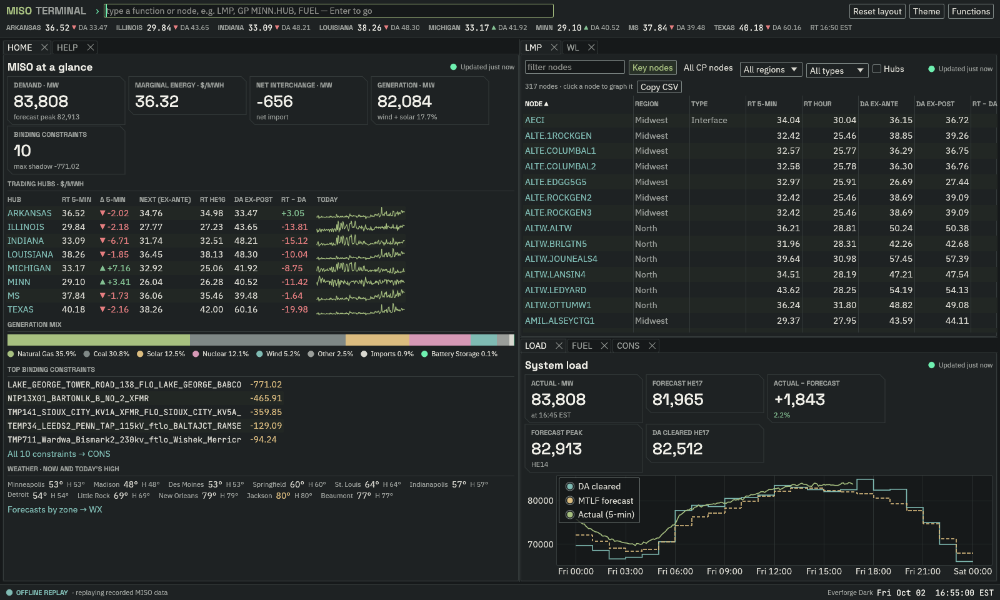
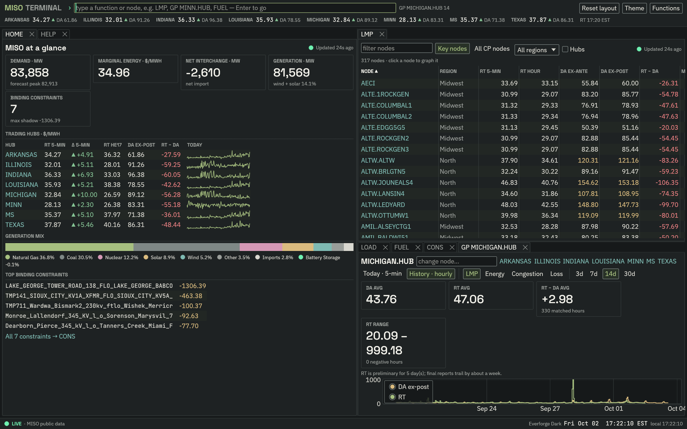
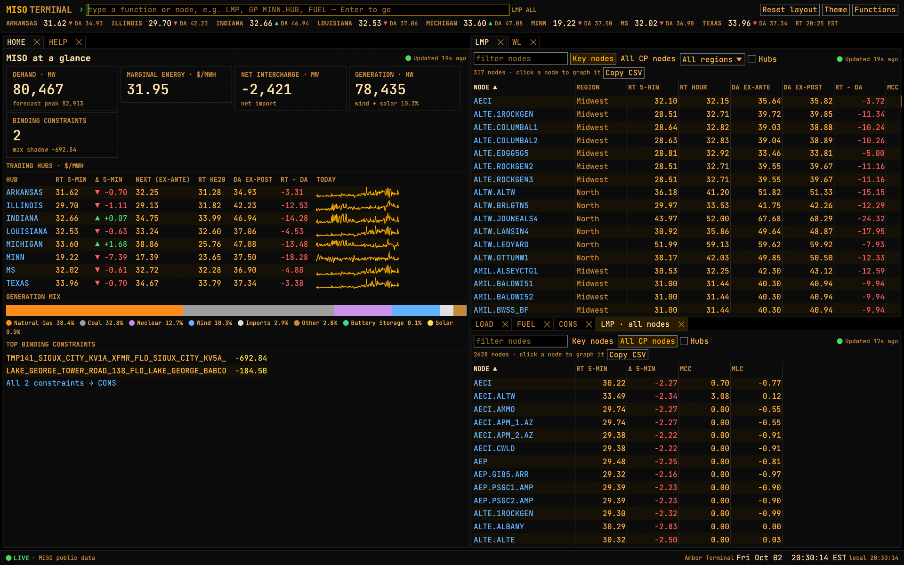
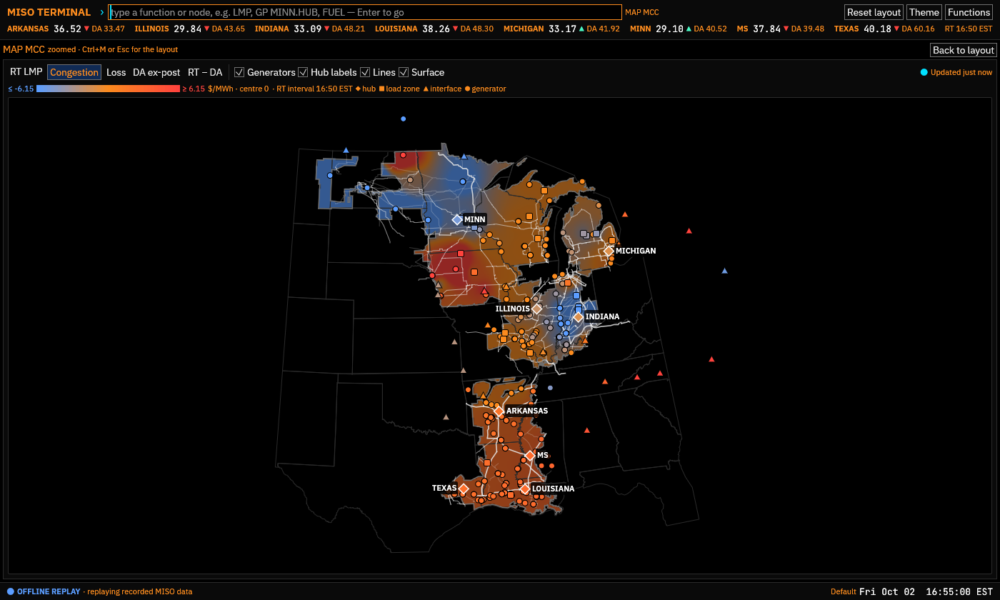

# MISO Terminal

A Bloomberg-style information terminal for the Midcontinent ISO, written in Rust.
It covers prices, load, generation, interchange, constraints and outages in one
keyboard-driven, tiled workspace. It is read-only: it shows MISO's public data
and never submits anything to MISO.



- **Command line first.** Type `LMP`, `GP MINN.HUB`, `MINN.HUB GP 14`, or just a
  node name, then press Enter. Completion covers every function and every pricing node.
- **Tiled, tabbed workspace.** Drag tabs to split panes. Your layout is saved
  between sessions.
- **Live.** Real-time feeds refresh once a minute (MISO's limit). Daily market
  reports are cached on disk, so history loads instantly the second time.
- **Themed.** Ships with **Everforge Dark** (the default), Everforge Light and
  Amber Terminal. Drop a TOML file into the themes folder to add your own; it
  hot-reloads while you edit it.
- **Built for Windows.** A single `.exe` with a native window, Windows certificate
  store TLS (corporate proxies work), a per-user or portable data layout and an
  embedded icon. The data, MISO and theme crates also build and test on Linux.

| | |
|---|---|
|  |  |



## Quick start (Windows)

```powershell
# Rust stable (https://rustup.rs) and the MSVC build tools are required.
git clone https://github.com/ArenKDesai/miso-terminal
cd miso-terminal
cargo run --release
```

Useful flags:

| Flag | What it does |
|---|---|
| `--offline [DIR]` | Replay the recorded responses in `fixtures/` instead of calling MISO. Use it for demos, UI work, or when MISO is down. |
| `--home DIR` | Portable mode: keep everything in `DIR`. Also enabled by `MISO_TERMINAL_HOME`, or a file named `portable` next to the exe. |
| `--run "CMD"` | Run a command at startup (repeatable), e.g. a desktop shortcut with `--run "GP ALTE.ALTE"`. |
| `--reset-layout` | Start from the default layout. |

Files live in `%APPDATA%\MISO Terminal\config` (config, themes, fonts: these roam)
and `%LOCALAPPDATA%\MISO Terminal` (report cache, logs, window and layout state).
The `LOG` function shows the exact paths and has buttons to open them.

## Functions

| Code | Name | What it shows |
|---|---|---|
| `HOME` | Launchpad | Demand, marginal energy cost, interchange, generation, hub prices (RT, next-interval ex-ante, DA) with 5-min sparklines, fuel mix, top constraints |
| `LMP` | LMP monitor | ~300 key nodes with RT 5-min, RT hourly, DA ex-ante and ex-post, DART, MCC and MLC. Sortable and filterable. `LMP ALL` lists all ~2,600 CP nodes |
| `MAP` | Price map | Every node MISO plots, on a map of the footprint, coloured by RT LMP, congestion, loss, DA or RT − DA. Hover for the breakdown, click to graph |
| `GP` | Graph price | One node: today's 5-min RT vs the DA staircase (plus tomorrow's DA once posted), N days of hourly DA vs RT with stats, an hour × day heatmap (`GP MINN.HUB 14 HEAT`), or price duration curves (`… DUR`). Switch between LMP, energy, congestion and loss |
| `SPRD` | Node spread | A − B between any two nodes: today at 5 minutes, or hourly DA and RT spreads over N days, with stats. Use the congestion component for an FTR-style view |
| `WL` | Watchlist | Your favourite nodes: RT vs DA, 5-min change and today's sparkline. Add from here, with `WL <node>`, or with ☆ in GP. Saved to config |
| `ASM` | Ancillary MCPs | Regulation, spinning, supplemental, short-term reserve and ramp MCPs by zone |
| `LOAD` | System load | 5-min actual vs MTLF forecast vs DA cleared, with forecast error |
| `CAP` | Capacity & headroom | Committed capacity vs demand, forecasts, available capacity |
| `FUEL` | Fuel mix | Generation by fuel now, plus a stacked chart of the day |
| `RENEW` | Wind & solar | Hourly forecast vs actual for today and tomorrow, with forecast bias |
| `NSI` | Interchange | Net scheduled interchange by neighbour, plus 5-min history |
| `RDT` | Regional transfer | North-South regional directional transfer over the last day against its limits, with utilisation |
| `ACE` | Area control error | 30-second ACE over the last two hours: how far generation is from balancing load |
| `WX` | Weather | Now, today's and tomorrow's high/low, dew point, wind and the 48-hour trend for a city in each MISO zone (National Weather Service); hourly chart for all or one |
| `CONS` | Binding constraints | RT binding constraints, shadow prices, and how long each has bound |
| `OUT` | Generation outages | Planned, unplanned, forced and derated MW for ±5 days |
| `ALRT` | Alerts | Price (any node, above/below) and constraint alerts: add rules, see which hold, and what fired. A firing rule flashes the taskbar and shows a ⚠ badge |
| `LOG` | Data feeds & log | Every feed's freshness and errors, fetch activity, cache and file locations |
| `SET` | Settings | Zoom, price highlighting thresholds, history length, cache cap, request limits and MISO endpoints, saved to config.toml |
| `THEME` | Themes | Switch, preview and contrast-check themes, or copy one to edit |
| `HELP` | Help | Functions, keyboard shortcuts, data notes |

Right-click a tab title to copy the panel as an image or save it as a PNG (to
`Pictures\MISO Terminal`).

Keyboard: `Ctrl+K` or `Esc` focuses the command line, `Enter` runs it, `Tab`/`↑`/`↓`
pick a suggestion, `F1` opens help, `F5` refreshes every open feed, and
`Ctrl+Shift+L` resets the layout.

## Data

Everything comes from MISO's public sources:

- The **real-time data API** at <https://public-api.misoenergy.org/>, which
  replaced the old `MISORTWDDataBroker` feeds on 2025-12-12. MISO asks that each
  link be polled at most once a minute; the terminal refreshes every 60 s and
  enforces a per-URL minimum interval on top.
- The **daily market reports** at `docs.misoenergy.org/marketreports`
  (`<yyyymmdd>_da_expost_lmp.csv`, `_rt_lmp_final.csv`, `_rt_lmp_prelim.csv`).
  The final RT report trails by about a week; until it lands, GP uses the
  preliminary one and says so.

All times are **market time, EST all year** (UTC-5, no daylight saving).
Five-minute intervals are stamped by their start (00:00 through 23:55).

> For information only. This is not an official MISO product and is not meant
> for operational or settlement decisions.

## Themes

Themes are TOML files with semantic slots: background, surface, text, accent,
positive, negative, chart series, fuel colours, fonts and spacing. Panels only
use those slots, so any theme works with any panel. See [`themes/README.md`](themes/README.md)
for the format.

- **Built-in:** `everforge-dark` (default), `everforge-light`, `amber-terminal`.
- **Yours:** run `THEME`, click *Copy to edit*, then edit the file in the themes
  folder. It reloads every time you save. A theme whose `id` matches a built-in
  replaces it. Validation flags unreadable contrast.
- **Fonts:** the three Everforge typefaces (IBM Plex Sans, JetBrains Mono, Space
  Grotesk; all SIL OFL) are bundled. Themes can name any installed font, or a
  font file dropped into the fonts folder.
- **Everforge stays in sync with its tokens.** The two Everforge themes are
  generated from the Everforge design tokens:
  `cargo run -p mt-theme --example sync_everforge -- ..\everforge`

## Development

```powershell
cargo test --workspace            # unit, parser-fixture and headless UI smoke tests
cargo clippy --workspace --all-targets
cargo fmt --all
cargo run -- --offline            # UI work without touching MISO
cargo run -p mt-miso --example capture_fixtures   # re-record fixtures from live MISO
uv run tools/screenshot.py docs/screenshots/x.png --run "GP MINN.HUB"
```

The workspace is layered so that each part can change without touching the others:

```
crates/
  mt-core       domain model: prices, load, fuel, constraints, market time (no I/O)
  mt-data       source-agnostic data hub: queries, cache, refresh, transports
  mt-miso       MISO endpoints, response parsers (fixture-tested), queries
  mt-nws        National Weather Service forecasts (the template for non-MISO sources)
  mt-theme      theme model, TOML loading, validation, built-ins (no UI toolkit)
  mt-ui         egui front end: shell, command line, workspace, functions
  miso-terminal the binary: paths, logging, runtime, window
```

Read [`docs/ARCHITECTURE.md`](docs/ARCHITECTURE.md) for how data flows and why,
and [`docs/EXTENDING.md`](docs/EXTENDING.md) for step-by-step recipes: adding a
function, a dataset, a non-MISO source, or a theme. CI runs on Windows (fmt,
clippy, tests, release build). A weekly job re-records MISO's feeds and runs the
parsers against them. Pushing a `v*` tag builds a Windows zip release.

## TODO

Roughly in priority order within each area. The architecture docs explain where
each piece plugs in.

### Data
- [x] Yesterday's five-minute RT alongside today's in GP (MISO's `Previous` feed, on demand).
- [ ] **Persist intraday history** across restarts (SQLite or Parquet under the
      cache dir), so 5-min charts span more than two days.
- [ ] **Long history from a local archive:** a `Query` source backed by the
      Energy-Pricing-Journalist DuckDB (DA/RT nodal LMPs since 2023-01-01), or a
      Parquet export of it. GP then gets `90d`, `1y` and more.
- [x] Hub **ex-ante LMPs** (next interval) on HOME.
- [x] New MISO feeds: `ACE` and `RDT` (regional directional transfer vs limits).
- [ ] More MISO feeds: reserve and sub-regional constraints, RSG commitments,
      short-term reserve requirements, NAI.
- [ ] More market reports: DA ex-ante LMPs, DA/RT binding-constraint history,
      MCP history, load-zone summaries.
- [ ] **Node metadata** beyond the 317 mapped nodes: type, zone and LBA for every
      CP node, for filtering (`geo.rs` already carries type and position for the mapped ones).
- [x] Weather by MISO zone (`WX`, National Weather Service): the first non-MISO source (`mt-nws`).
- [ ] More context sources: gas prices (EIA, needs a free key), neighbouring ISO
      prices at the seams (PJM, SPP).
- [x] Disk-cache size cap with least-recently-used pruning (`data.cache_max_mb`).
- [ ] An in-app switch between live data and offline replay.

### Functions and UI
- [x] `MAP`: node price map (LMP, congestion, loss, DA, DART) built from MISO's own node positions; click to GP.
- [ ] MAP: an interpolated price surface and transmission lines (3D-MISO-Map has both).
- [x] `SPRD A B`: node-to-node spreads (today at 5 minutes, hourly history, by component).
- [x] Hour × day heatmap for a node or a spread (`GP <node> 14 HEAT`, `SPRD A B 14 HEAT`).
- [x] Price duration curves for a node or spread (`GP <node> 30 DUR`).
- [x] **Alerts** (`ALRT`): per-node price thresholds and constraint conditions,
      edge-triggered, with a taskbar flash and an in-app badge.
- [ ] More alert kinds (load forecast miss, RDT near limit, spread thresholds) and
      Windows toast notifications.
- [x] `WL` watchlist of favourite nodes, editable in-app (☆ in GP) and saved to config.
- [ ] Pop a tab out into its own OS window (egui_dock windows + eframe viewports)
      for multi-monitor desks.
- [x] Copy tables as CSV (LMP, WL, GP and SPRD history).
- [x] Copy a panel to the clipboard as an image, or save it as PNG (right-click its tab).
- [x] `SET`: edit `config.toml` values in-app.
- [x] Command line: usage hints for the function being typed.
- [ ] Command line: fuzzy matching and Bloomberg-style function-key menus.
- [x] Contain panel panics to their tab (logged, with a *Reload panel* button).

### Themes
- [x] Follow the Windows light/dark setting with a chosen light/dark pair (`THEME`).
- [ ] Everforge's chamfered corners (`cut-md`) on hero tiles and the active tab.
- [ ] A high-contrast accessibility theme.
- [ ] Optionally make `miso-terminal` a target in Everforge's own `build.py`
      (per its port policy) instead of the sync example here.

### Windows distribution
- [ ] Installer (MSI via `cargo-wix`, or MSIX for winget).
- [ ] **Code signing.** Unsigned executables trip SmartScreen and Smart App Control.
- [ ] Single instance, plus jump-list entries for favourite functions.
- [ ] An update check against GitHub releases.

### Engineering
- [ ] Visual regression tests with `egui_kittest` snapshots, per theme.
- [x] A weekly CI job (`drift.yml`) that records live responses and runs every
      parser against them, to catch MISO format changes early.
- [ ] Benchmarks for the rolling-feed parser (~33 MB of JSON per seed).
- [ ] Publish the GitHub repository and turn on CI.
- [ ] Choose a licence (the bundled fonts are OFL; see `assets/fonts/`).
