# Tutorials

Short, hands-on walkthroughs of what MISO Terminal does. Each one takes a few
minutes and builds on the command line from the first. The
[function table](../README.md#functions) is the reference; these pages show
how the pieces fit together.

Every screenshot here comes from the recorded data the terminal ships with, so
you can follow along without touching MISO: start it with `--offline` (see the
first tutorial) and the numbers will match.

## Your first ten minutes

1. **Start it.** Run `miso-terminal.exe`, or from a source checkout
   `cargo run --release`. To practise on recorded data instead of live feeds,
   add `--offline` (`cargo run --release -- --offline`); the status bar then
   says *OFFLINE REPLAY*.
2. **Find the command line.** It is the orange box at the top. `Ctrl+K` or
   `Esc` puts the cursor there from anywhere.
3. **Run a function.** Type `LMP` and press `Enter`. A tab opens with the LMP
   monitor. Everything in the terminal is a function with a short code like
   this; `HELP` (or `F1`) lists them all, grouped by subject, and clicking a
   code there opens it.
4. **Give it a subject.** Type `GP MINN.HUB` and press `Enter` for a price
   chart of the Minnesota hub. The subject can also come first, Bloomberg
   style: `MINN.HUB GP` does the same. A bare node, `MINN.HUB`, graphs it too.
5. **Add arguments.** `GP MINN.HUB 14` asks for fourteen days of history
   instead of today. As you type a code, the line to the right of the box
   shows its usage (`GP <node|security> [days] [HEAT|DUR|5MIN]`).
6. **Let completion type for you.** Start typing (`gp mi`) and suggestions
   appear: functions, all ~2,600 pricing nodes and, with Alpaca keys, tickers.
   `Tab` or `↑`/`↓` pick one, `Enter` runs it. Matching is forgiving: `michub`
   finds `MICHIGAN.HUB` and `spd` finds `SPRD`.
7. **Use the function keys.** `F2` HOME, `F3` LMP, `F4` MAP, `F6` WL, `F7`
   HUBS, `F8` WX, `F9` ALRT and `F10` LOG. `F5` refreshes every open feed.

Case never matters, and a trailing `GO` or `<GO>` is ignored, so Bloomberg
habits carry over.

## Arrange your workspace

Each function opens as a tab. The layout is yours to shape, and it is saved
when you close the terminal.

- **Split panes.** Drag a tab by its title onto the edge of another pane to
  split it, or onto the middle to stack it there.
- **Move between tabs.** `Ctrl+Tab` and `Ctrl+Shift+Tab` cycle the tabs in the
  focused pane; `Ctrl+W` closes one.
- **Zoom one panel.** Double-click a tab title, or press `Ctrl+M`, to fill the
  window with it. `Esc`, `Ctrl+M` or *Back to layout* returns.
- **Pop one out.** Right-click a tab title and choose *Open in new window* to
  put it on a second monitor. Close that window, or press *Dock*, to bring it
  back. It reopens where you left it next time.
- **Start over.** *Reset layout* (top right, or `Ctrl+Shift+L`) restores the
  default arrangement. `--reset-layout` does the same at startup.

To open straight into a view, give a shortcut a startup command:
`miso-terminal.exe --run "GP ALTE.ALTE 14" --run "MAP MCC"`. If the terminal is
already open, the commands run in that window instead of starting a second
one.

## Scan prices across the footprint

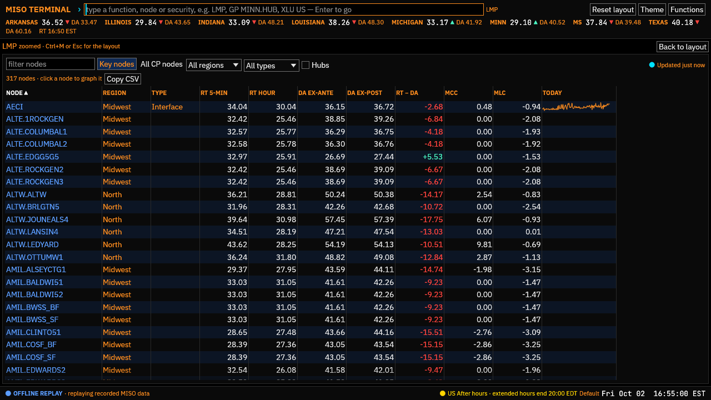

`LMP` (`F3`) is the price board: about 300 key nodes with RT five-minute, RT
hourly, DA ex-ante and ex-post prices, RT − DA, and the congestion (MCC) and
loss (MLC) components.

1. **Sort.** Click a column heading; click again to reverse. Sort by *MCC* to
   see where congestion is pushing prices up or down.
2. **Filter.** Type in *filter nodes* (`ALTW` keeps Alliant West's nodes),
   pick a region (North, Midwest, South) or a node type (hub, load zone,
   interface, generator). Tick *Hubs* for just the eight trading hubs.
3. **Widen.** *All CP nodes* (or `LMP ALL`) lists every commercial pricing
   node with this hour's DA and RT − DA.
4. **Drill in.** Click any node name to open its chart in GP.
5. **Take it with you.** *Copy CSV* copies the table as it is filtered and
   sorted, ready to paste into Excel.

For the same picture on a map, run `MAP` (`F4`). Each node is coloured by the
metric you choose at the top: *RT LMP*, *Congestion*, *Loss*, *DA ex-post* or
*RT − DA* (or open it on one directly: `MAP MCC`, `MAP DART`). Hover a node for
its breakdown into energy, congestion and loss; click it to graph it. The
checkboxes show or hide generator nodes, hub labels, the 230 kV-and-up
transmission lines, and the interpolated price surface. A band of colour
across a line of nodes is usually a binding constraint: check `CONS` to name
it.

## Chart a node

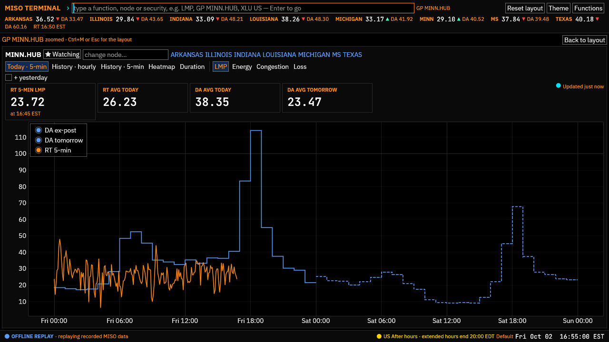

`GP <node>` is the workhorse. It opens on **Today · 5-min**: real-time prices
every five minutes against the day-ahead staircase, with tomorrow's DA dashed
once MISO posts it in the early afternoon. Tick *+ yesterday* to lay yesterday
underneath.

The row of buttons switches the view without retyping:

| View | What it answers | Typed directly |
|---|---|---|
| *History · hourly* | How have DA and RT compared over the last N days? With averages, RT − DA, extremes and the hours RT beat DA | `GP MINN.HUB 14` |
| *History · 5-min* | What did five-minute RT do on past days? Built from prices saved while the terminal runs | `GP MINN.HUB 7 5MIN` |
| *Heatmap* | Which hours of which days run hot? Colour by RT, DA or RT − DA | `GP MINN.HUB 14 HEAT` |
| *Duration* | How often is the price above a level? Sorted price duration curves for DA and RT | `GP MINN.HUB 30 DUR` |

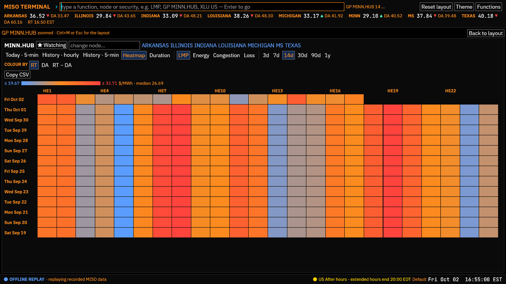

Next to the views:

- **Components.** *LMP*, *Energy*, *Congestion* and *Loss* chart that part of
  the price. Congestion is where nodes differ from one another; energy is
  nearly the same everywhere.
- **Days.** *3d* to *1y*. History comes from MISO's daily market reports and is
  cached on disk, so a window loads instantly the second time. Until MISO's
  final RT report lands (about a week), GP uses the preliminary one and says
  so.
- **Other nodes.** Type in *change node…*, or click one of your favourites
  listed beside it (the eight hubs by default).
- **☆ Watch** adds the node to your watchlist; it turns to *★ Watching*.
- **Copy CSV** under the history views copies the hourly DA, RT and RT − DA.

## Compare nodes and read spreads

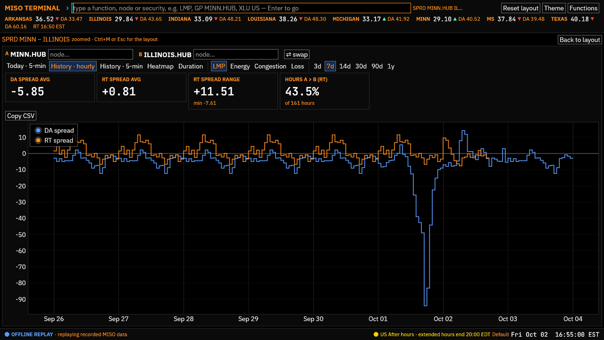

**Spreads.** `SPRD MINN.HUB ILLINOIS.HUB 7` charts A − B. The tiles give the
average DA and RT spreads, the RT range and the share of hours A priced above
B. *⇄ swap* flips the pair. It has the same views as GP (today, hourly, five
minute, heatmap, duration), so `SPRD A B 30 HEAT` shows which hours a spread
blows out. Switch to *Congestion* for an FTR-style view: the congestion spread
is what a financial transmission right between the two nodes would have
collected.

**Several nodes at once.** `CMP MINN.HUB MICHIGAN.HUB ILLINOIS.HUB 7` puts up
to eight nodes on one chart: today's five-minute RT, or hourly RT or DA over N
days, with a latest / average / range row for each. Add or remove nodes in the
panel; ✕ drops one.

**All the hubs at once.** `HUBS 30` (`F7`) lays the eight trading hubs side by
side over N days: DA, RT and DART averages, on-peak and off-peak blocks, RT
volatility, extremes and how often RT beat DA.

**Tomorrow's strip.** `DAM` shows hourly DA prices at the hubs for tomorrow
once posted (today before then), with on-peak, off-peak and all-hours
averages. `DAM TODAY` and `DAM YESTERDAY` pick a day, and *Change vs day
before* shows how each hour moved.

## Reach back years

Every daily report the terminal downloads is kept on disk for every node (the
price history), so a day is downloaded once and charts read it from disk
afterwards. A chart downloads the days it is missing from the last 90 days,
a day at a time (the first long window takes a while); older days it shows
from the price history. `GP MINN.HUB 365`, `SPRD`, `CMP` and `HUBS 365` reach
back as far as the price history goes, and say how many older days it lacks,
with a *Price history…* button that opens `SET`.

**Fill it in ahead of time.** `SET` → *Price history* chooses how far back to
keep (*3 months* by default, up to *Everything since 2023-01-01*, the first
day MISO publishes) and shows what is stored. *Download now* fetches the
missing days in the background, newest first, one report every two seconds:
three months is about 230 MB to download and 30 MB on disk, and takes about
eight minutes. Keep working meanwhile; the status bar counts the reports
(click it for `SET`) and `LOG` lists them. *Pause* stops it, and it carries on
where it stopped, after a restart too. Once done it keeps the window filled
every day, and swaps preliminary RT days for MISO's final prices when they
come out (five or six days later). Days before the window are removed.

Five-minute history is different: MISO publishes only today and yesterday at
five minutes, so the terminal keeps its own archive of every day it runs (90
days by default; *Five-minute archive* in `SET`). `GP <node> 7 5MIN` and
`SPRD A B 7 5MIN` read it.

## Build a watchlist

`WL` (`F6`) keeps the nodes you care about in one place: RT five-minute price,
its last change, RT hourly, DA, RT − DA and today's sparkline.

- Add a node with *add a node…*, with `WL ALTE.ALTE` on the command line, or
  with *☆ Watch* in GP.
- Remove one with ✕. Click a name to graph it.
- Your watchlist nodes are listed first in every node picker and completion,
  and appear as quick links in GP.
- With Alpaca keys, a *Securities* section holds stocks and ETFs too (see
  [Follow energy stocks](#follow-energy-stocks)); *Open in Q* shows them in
  the quote monitor.

The list is saved in `config.toml` (`favorite_nodes`, `favorite_securities`).

## Set up alerts

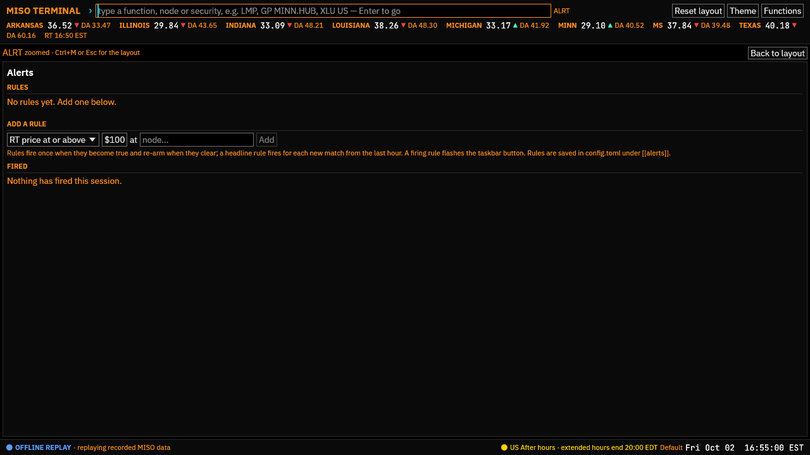

`ALRT` (`F9`) watches the data for you. To add a rule:

1. Pick a kind from the drop-down under *Add a rule*.
2. Fill in its node(s), threshold or text.
3. Press *Add*.

| Kind | Fires when | Example |
|---|---|---|
| *RT price at or above* / *at or below* | A node's five-minute RT LMP crosses the level | `MINN.HUB` at $100 |
| *RT spread A − B at or above* | One node's RT price exceeds another's by the amount | `MINN.HUB` − `ILLINOIS.HUB` ≥ $25 |
| *Constraint binds* | A binding constraint's name contains the text | `GENOA` |
| *Any \|shadow price\| at or above* | Any constraint binds at least this hard | $500 |
| *N–S transfer at or above % of limit* | North-South transfer nears its limit | 90% |
| *Load above forecast by at least %* | Actual load runs above MISO's forecast for the hour | 3% |
| *\|ACE\| at or above MW* | Area control error swings | 500 MW |
| *Headline mentions* | A headline from the last hour matches any keyword | `MISO, PJM, power prices` |

Each rule shows whether it is *armed*, *triggered* or *waiting for data*.
Rules are edge-triggered: a rule fires once when its condition becomes true
and re-arms when it clears, so a price sitting above $100 does not fire every
minute. A headline rule fires again for each new matching headline.

When a rule fires, the taskbar button flashes, the status bar shows a
*⚠ alert(s)* badge (click it to open ALRT), and, if the terminal is in the
background, Windows shows a notification. A burst of alerts becomes one
summary. *Windows notifications* turns those off; *Send a test* shows one. The
*Fired* list keeps this session's history.

Rules are saved in `config.toml`, so you can also write them there, at the
end of the file:

```toml
[[alerts]]
kind = "price_above"
node = "MINN.HUB"
value = 100.0

[[alerts]]
kind = "spread_above"
a = "MINN.HUB"
b = "ILLINOIS.HUB"
value = 25.0

[[alerts]]
kind = "headline_mentions"
keywords = "MISO, PJM, power prices"
```

## Watch the grid

Prices are half the story. These functions show why prices are moving; each
fits in a pane beside a GP chart.

| If you want to know… | Run |
|---|---|
| How load is tracking MISO's forecast | `LOAD` |
| How much committed capacity is left above demand, and tomorrow's reserve requirement | `CAP` |
| What is generating now, and through the day | `FUEL` |
| Whether wind and solar are coming in above or below forecast | `RENEW` |
| Which transmission constraints bind, how hard and for how long | `CONS` |
| What bound yesterday (or any day) in DA and RT, and what it cost | `BCH`, `BCH 1`, `BCH 2026-09-30` |
| How close the North-South transfer is to its limit | `RDT` |
| How far generation is from balancing load right now | `ACE` |
| How much power is flowing in from each neighbour | `NSI` |
| Prices at the seams, and PJM's CTS forecast against MISO's price | `SEAM` |
| What reserves are clearing at | `ASM` |
| Which generation is out, planned or forced, over ±5 days | `OUT` |
| Gas at Henry Hub, and the heat rate and spark spread each hub implies | `GAS` |
| Temperatures and the 48-hour outlook across the footprint | `WX` |

`HOME` (`F2`) puts the headline numbers from most of these on one screen:
demand, marginal energy cost, interchange, generation, hub prices with
sparklines, fuel mix, top constraints, weather and the top stories. Click a
hub there to graph it.

A typical morning: `HOME` for the overview, `DAM` for today's strip, `CONS` and
`MAP MCC` to see where congestion sits, and `LOAD` and `RENEW` to see whether
the forecasts are holding.

## Follow the news

Three functions share one headline browser:

- **`TOP`**: the newest top stories from the Financial Times, Bloomberg and the
  Washington Post.
- **`NEWS`**: every headline from every feed, kept for three weeks so search
  reaches back across restarts. Filter by publisher (`NEWS FT`, `NEWS BBG`,
  `NEWS WP`) or by words (`NEWS natural gas`).
- **`NI`**: headlines on a topic. `NI` alone lists the topics with today's
  counts; `NI POWER`, `NI GAS` or `NI POLICY` opens one.

Click a headline to read its summary below the list. Then `↑`/`↓` move,
`PgUp`/`PgDn`/`Home`/`End` jump, and `Enter` (or a double-click) opens the
article in your browser, where your own subscriptions apply. Opened headlines
are marked read; *Unread only* hides them, and *Mark all read* marks every
headline listed.
The terminal keeps headlines and summaries only; it never downloads articles.

To make the news yours, add tables like these at the end of `config.toml`
(`SET` → *Open config folder*):

```toml
# Your own topic for NI (NI DATACENTERS). Capitals match capitals only;
# a trailing * matches any ending.
[[news.topics]]
name = "DATACENTERS"
description = "Data-centre load and the grid"
keywords = ["data center*", "data centre*", "hyperscale*", "AI load"]

# Any RSS or Atom feed.
[[news.feeds]]
id = "my-feed"
source = "Energy News Network"
section = "Midwest"
url = "https://example.org/feed.xml"
```

Built-in feeds can be switched off in `SET` under *News feeds*. To be told
about a story as it breaks, add a *Headline mentions* alert.

## Follow energy stocks

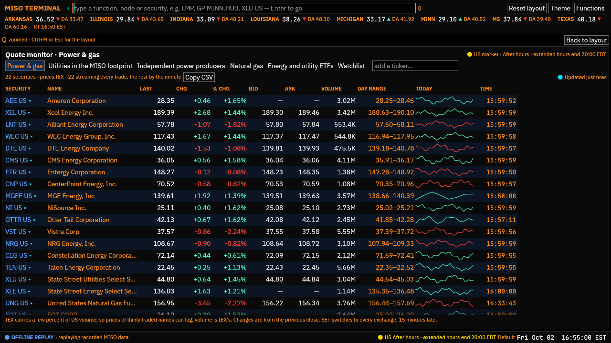

The terminal shows stock and ETF prices from Alpaca, using your own free
account.

**Connect Alpaca once.**

1. Sign up at [alpaca.markets](https://alpaca.markets). No deposit is needed
   for market data or paper trading.
2. In Alpaca's dashboard, create **paper trading** API keys.
3. In the terminal, run `SET`, scroll to *Credentials*, paste the *Alpaca
   paper key ID* and *Alpaca paper secret key*, and press *Save* for each.
4. The line underneath should read *Alpaca: connected*. If it shows an error,
   check the keys and press *Check again*.

The keys go to Windows Credential Manager, never to a file.

**Write securities Bloomberg-style**: ticker, then market code. `XEL US` is
Xcel Energy; `XEL` on its own would be read as a node name. Completion offers
tickers and company names, and after a security, the functions that take one
(type `XEL US ` and it suggests `GP`, `DES`, `Q`, `CN`…).

**Try these:**

- `Q`: the quote monitor on the *Power & gas* list (utilities in the footprint,
  independent generators, energy ETFs, gas producers): last, change, bid and
  ask, volume, day range and today's chart, streaming. The buttons switch to
  the other built-in lists (also `Q UTILITIES`, `Q GAS`), *Watchlist* shows
  `Q WL`, and *add a ticker…* or `Q XEL US AEE US` builds your own.
- `GP XEL US`: today's session minute by minute against the previous close.
  *5D* is a few days at 15 minutes; *1M* to *10Y* are daily closes. Typed
  directly: `GP XEL US 365`.
- `DES XEL US`: what the company is, where it lists, how it trades with Alpaca,
  and its year's range and returns.
- `CN XEL US`: Benzinga's stories about it, arriving live. `CN` alone covers
  your watchlist's securities.
- `WL XEL US`: adds it to your watchlist.

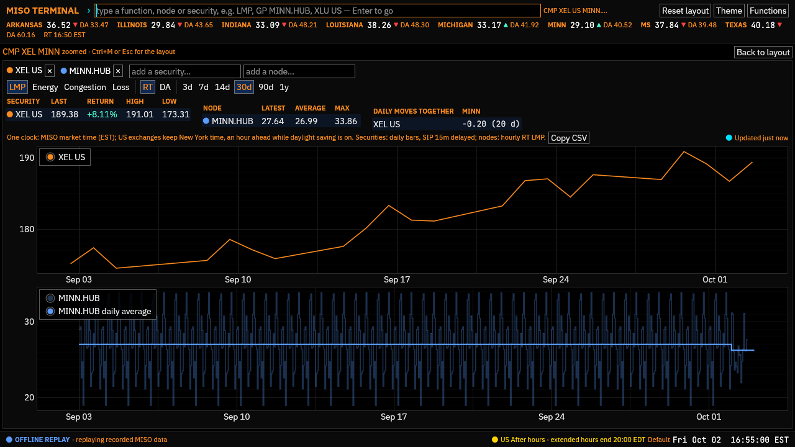

**Put stocks next to power prices.** `CMP XEL US MINN.HUB 30` draws the stock
above the node on one time axis, and *Daily moves together* gives the
correlation of their day-to-day changes. It takes up to four securities and
four nodes. Everything is drawn in MISO market time, so the two line up.

**Know what you are looking at.** On the free plan, live prices come from the
IEX exchange alone (a few percent of US volume, so thinly traded names can
lag). `SET` → *Live prices* can switch to every exchange, fifteen minutes
late. Every price is labelled with its feed, and the status bar shows whether
the US market is open. Daily history always comes from every exchange.

Your own lists for `Q` go at the end of `config.toml`. A list named after a
built-in one (`POWER`, `UTILITIES`, `GENERATORS`, `GAS`, `ETFS`) replaces it:

```toml
[[markets.lists]]
name = "MINE"          # Q MINE
title = "My utilities"
symbols = ["XEL", "WEC", "AEE", "MGEE"]
```

## Track your paper account

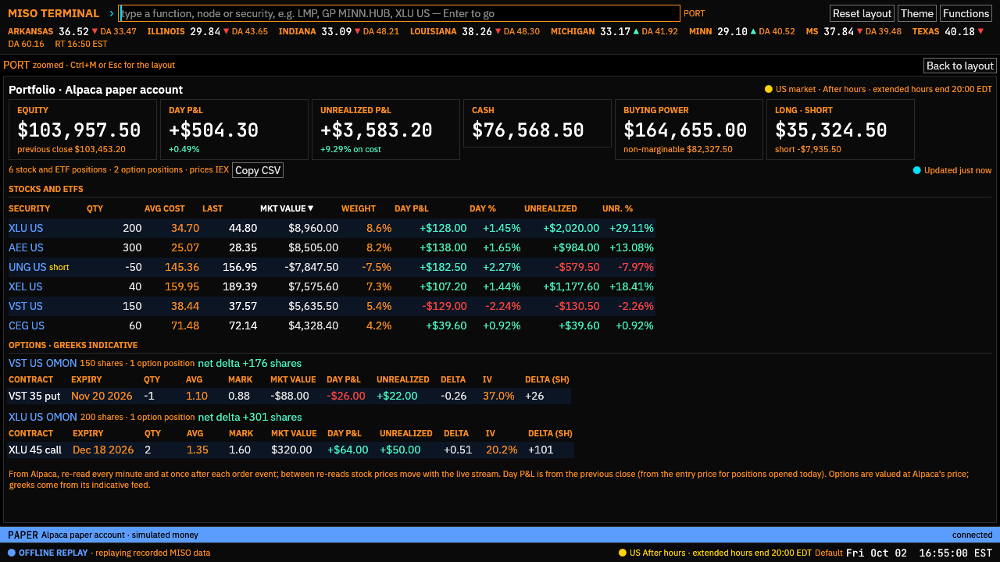

The Alpaca keys from the last tutorial also open your **paper account**: Alpaca's
practice account, with simulated money. This tutorial reads it; the next one
trades in it. Whenever an account is connected, a **PAPER** band runs across
the window above the status bar, saying whether the account answers. Click *PAPER*
to open `ACCT`.

**Try these:**

- `PORT`: equity, today's P&L, cash and buying power on top, then every position
  with quantity, average cost, last price, market value, its weight in the account,
  and P&L for today and since you bought. Click a column heading to sort, a
  security to chart it. Alpaca values the positions once a minute; in between,
  stock prices move with the live stream (a price newer than Alpaca's turns
  green). Options sit underneath, grouped by the stock they are on, with a **net
  delta**: the number of shares the stock and its options move like together.
- `ACCT`: whether the account is active or blocked, its balances, buying power
  and margin (with how much equity is spare above the maintenance requirement),
  day trades used out of the three allowed below $25,000 of equity, and the
  options level.
- `PNL`: today's equity every five minutes, against the previous close.
  *1W* is a week hourly; *1M*, *3M* and *1Y* are daily. The tiles give the change,
  the high and low, and the deepest drawdown. `PNL 1Y` opens straight on the year.
- `ACT`: fills, dividends, fees, transfers and option exercises, assignments and
  expiries, newest first. The buttons filter by kind (`ACT FILLS`, `ACT DIV`) and
  the box by symbol. Order events appear at the top as they happen, and the other
  panels re-read the account straight away when one arrives.
- `HOME` gains a *Paper equity* tile with today's P&L; click it for `PORT`.

**Mind what you share.** The band never shows a balance and `ACCT` masks the
account number, so a screenshot of the terminal carries neither. `PORT`, `PNL`
and the HOME tile do show amounts.

## Trade on paper

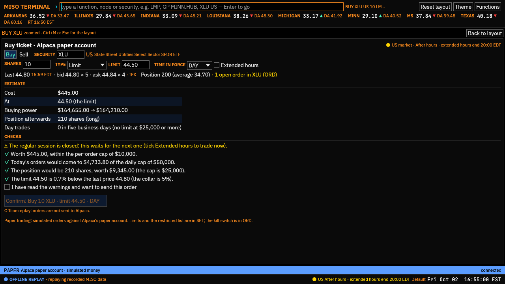

Orders go to the same paper account, and only through a **ticket** that you
confirm. Type the order as a command and the ticket opens filled in; nothing is
sent until you click its *Confirm* button. A command from anywhere else (a
desktop shortcut's `--run`, a second launch, a function key) can open a ticket
too, but never send it. With `--offline` the tickets work and say why nothing
is sent.

**Try these:**

- `BUY XLU US 10 LMT 44.50 DAY`: a ticket to buy ten shares of XLU at $44.50 or
  less, good for the day. After the security the pieces come in any order: the
  number of shares; the type (`MKT`, `LMT 44.50`, `STP 42`, `STPLMT 42 41.80`, or
  `@44.50` for a limit); the time in force (`DAY`, `GTC`, `IOC`, `FOK`, `OPG` for
  the opening auction, `CLS` for the closing one); and `EXT` to allow extended
  hours. Leave the price out and the limit starts at the last trade.
- `SELL XLU US 200`, or right-click a position in `PORT` and choose *Close the
  position*: a ticket to sell. Selling what you do not hold opens a short, which
  the ticket points out.
- On the ticket, switch *Buy* and *Sell*, or change the *Shares*, *Type*, prices
  and *Time in force*. Under *Estimate* are the cost (or proceeds), buying power
  before and after, the position afterwards and your day trades. Under *Checks*
  is every guardrail: ✓ when it passes, ⚠ when it wants a second look, × when it
  stops the order.
- When there are warnings, tick *I have read the warnings and want to send this
  order*. Then *Confirm* sends it, and the ticket follows it: *Placed*, then its
  fills as they happen. *Cancel order* cancels it; *New order* starts another from
  the same fields.
- `ORD`: every order, kept current by Alpaca's order stream, open ones first
  (*Open*, *Filled*, *Cancelled, expired, rejected*, *All*; `ORD ALL`). *Cancel*
  and *Replace…* work on open orders; a replace changes the quantity or a price
  and goes through the same checks.

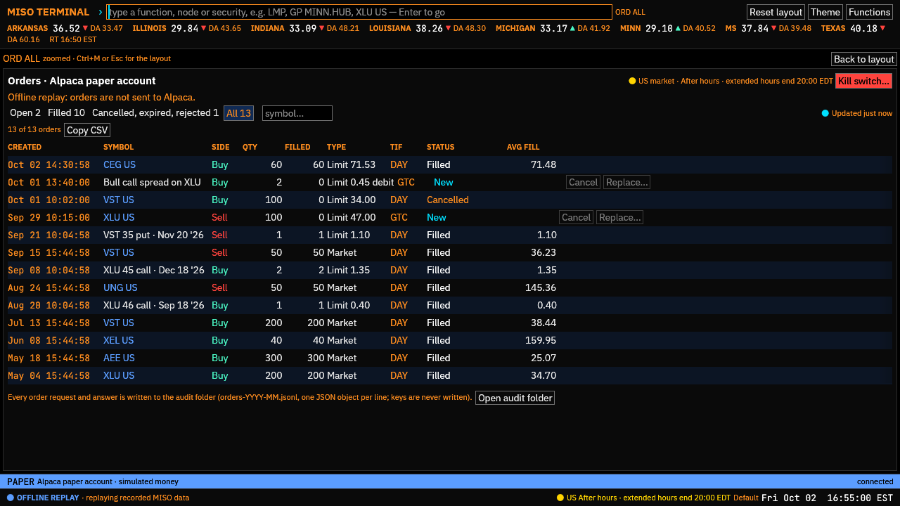

**The guardrails** live under `[trading]` in config.toml, and in SET under
*Trading (paper)*:

```toml
[trading]
enabled = true              # the kill switch turns this off
max_order_value = 10000     # dollars per order
max_daily_value = 50000     # today's orders: what filled plus what is still open
max_position_value = 25000  # in one security, long or short
collar_pct = 5.0            # limit and stop prices within 5% of the last trade (options: of the bid or ask)
fat_finger_pct = 10.0       # orders over 10% of equity need the tick box
max_shares = 5000           # shares in one order
max_contracts = 50          # option contracts in one order
max_price_age_secs = 120    # how old the latest price may be when an order trades at once
restricted = ["MGEE"]       # never trade these, nor their options
```

A cap of 0 turns it off. Some rules always hold: market orders only in the
regular session (09:30 to 16:00 New York time; use a limit order, with *Extended
hours* to trade before or after), enough buying power for what the order opens,
no order that turns a long position short (or a short one long) in one go, no
selling shares that open orders already hold, and Alpaca's limit of three day
trades in five business days below $25,000 of equity.

When an order would trade as soon as it arrives (in the regular session, or
before and after it with *Extended hours*), the price the caps and the collar
use must be recent: older than `max_price_age_secs`, a market order is refused
and any other order needs the tick box. A stream that has stopped, an option
chain that has not refreshed, or the 15-minute-delayed feed all show up here;
for a spread, the oldest leg's quote counts. 0 turns the check off.

**The kill switch.** *Kill switch…* at the top right of `ORD` cancels every open
order and, if you tick the box, closes every position at the market. It also
turns trading off: tickets cannot send anything until you click *Turn trading
on* in `ORD` (or tick it in SET), and the band at the bottom says so. `ORD KILL`
opens it straight away.

**If an answer gets lost.** Each ticket gives its order an id before sending it.
If Alpaca does not answer (a dropped connection, a timeout), the ticket asks
Alpaca for that id before anything else: found, it shows the order; not found,
*Send again* sends it under the same id, which Alpaca will not accept twice. So
an order can never go in twice.

**The audit log.** Every order request and Alpaca's answer is written, a line
each, to `orders-YYYY-MM.jsonl` in `%LOCALAPPDATA%\MISO Terminal\audit` (*Open
audit folder* in `ORD`). Your keys are never written there.

If you work in energy or financial markets, check your employer's
personal-trading policy before you ever trade live; some require pre-clearance
or forbid certain names. Put those names on the restricted list.

## Trade options on paper

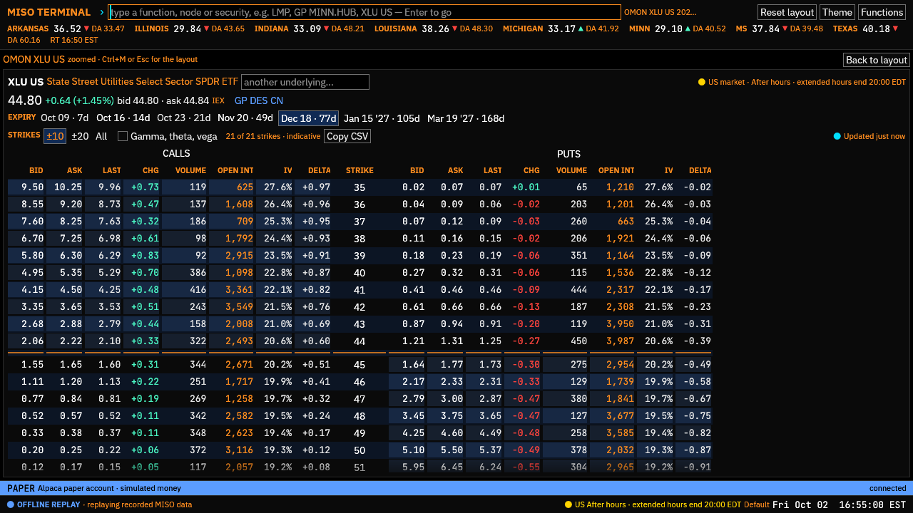

Options trade in the same paper account, through the same kind of ticket. On
Alpaca's free plan their prices come from its *indicative* feed: quotes derived
from the official ones and sampled, trades fifteen minutes late. The terminal
says so beside every figure.

**Read a chain.**

- `OMON XLU US`: XLU's option monitor. Calls are on the left, puts on the right,
  the strike between them. Each shows its bid, ask, last trade and the change,
  volume, open interest, implied volatility and delta; tick *Gamma, theta, vega*
  for the rest. Contracts in the money are shaded, and a line marks where the
  stock trades.
- The tabs along the top are the expiries (monthly ones in bold, the days to go
  beside each). *±10*, *±20* and *All* choose how many strikes either side of the
  money to show. `OMON XLU US 2026-12-18 ALL` opens one expiry with every
  strike.
- An option's symbol on its own, such as `XLU261218C00045000` (XLU, 18 Dec 2026,
  a call, strike 45.000), opens its chain at that contract. `DES XLU US` has an
  *OMON · Options* button, and `PORT` links each stock's options to OMON.

**Trade one contract.**

- Click an ask in OMON for a ticket to buy one contract at that price, or a bid
  to sell one; or right-click a contract and choose *Buy…* or *Sell…*. On the
  command line it is `BUY` or `SELL` with the option's symbol:
  `BUY XLU261218C00046000 2 LMT 1.16`. Leave the price out and the limit starts
  at the mid.
- The ticket says what the order does to your position (*Buy to open*, *Sell to
  close* and so on), and shows the quote and greeks, the premium (the price is
  per share, so a contract costs a hundred times it), options buying power
  before and after, and what it pays at expiry: the break-even and the most it
  can lose, or for a call you write, what happens if your shares are called
  away.
- To close an option you hold, right-click it in `PORT` and choose *Close the
  position*. You can also write a covered call against shares you hold, or a
  cash-secured put against buying power. Alpaca does not allow uncovered
  options, so the ticket blocks a call your shares do not cover.

**Build a spread.**

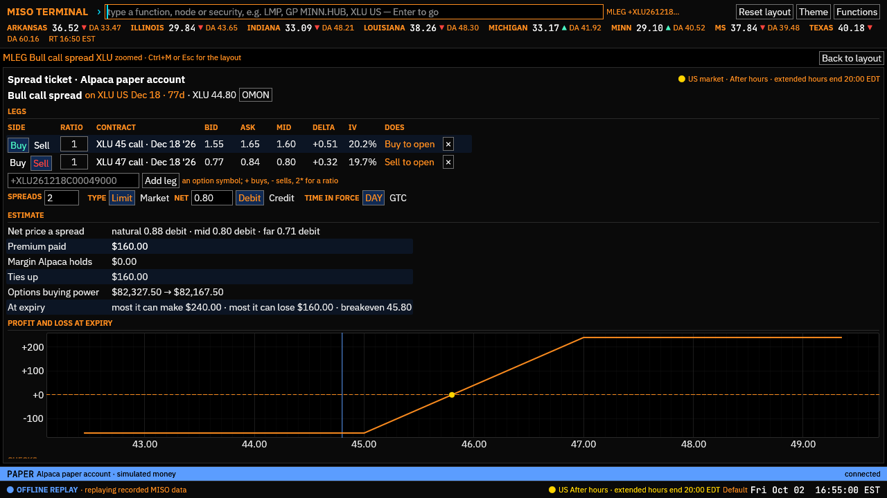

- Right-click a contract in OMON and open *Spread from this strike*: a bull or
  bear call spread, a bull or bear put spread, a straddle, a strangle, an iron
  condor or a butterfly, built from the strikes around it. The `MLEG` ticket
  opens with its legs filled in.
- Or add legs yourself: *Add to the spread as a buy* (or *as a sell*). A bar
  above the chain shows the spread, its name and its mid; *Open ticket…* opens it
  and *Clear* starts again.
- On the command line: `MLEG +XLU261218C00045000 -XLU261218C00047000 2 LMT 0.85`.
  `+` buys a leg and `-` sells it, `2*` before a symbol gives it a ratio, and a
  negative limit (or `CREDIT 0.40`) is a credit.
- The ticket lists the legs with their quotes and what each does; change a
  leg's *Buy*/*Sell* or ratio, add one by its symbol, or remove one with ✕. Under
  *Estimate* are the net price three ways (*natural*: crossing every leg's
  spread; the mid; the far side), the premium, the margin Alpaca holds, what the
  order ties up, and what it can make and lose at expiry, with a chart of profit
  and loss across the stock's price.
- Alpaca sends a spread as one order and fills the legs together. Every leg you
  sell must be covered by one you buy in the same order and expiry, so a
  calendar spread with the near month sold is refused. Spreads need options
  level 3 (paper accounts have it).
- In `ORD` a spread is one row named for its strategy; hover for its legs. To
  change one, cancel it and place it again.

**The option rules**, on top of the stock ones: the options level (2 to buy
calls and puts, 1 for covered calls and cash-secured puts, 3 for spreads;
closing needs none); no orders for a contract expiring today after 15:15 New
York time (15:30 for SPY and QQQ), and a warning earlier that day, since a
contract in the money by a cent at the close is exercised automatically; the
collar measured against the bid or ask (for a spread, against the natural
price); the exchanges' price steps; and `max_contracts` per order. A stock on
the restricted list takes its options with it.

## Make it yours

**Settings.** `SET` edits `config.toml` in place: zoom, the price levels that
are highlighted (*Highlight prices at or above*, $100 by default) and flagged
(*Flag prices at or above*, $500), the default history length for GP and SPRD,
the cache cap, the five-minute archive, the price history, news feeds, the
paper trading limits and the stock price feed. Press *Apply and save*; *Open
config folder* opens the file itself. (*Download now* and *Pause* under
*Price history* act at once.)

**Start over.** *Reset to defaults…* at the bottom of `SET` puts every setting
back as it was on first launch, after asking you to confirm. That includes your
watchlist, alerts, function keys, theme choice, and your own news feeds, topics
and Q lists, and stored prices older than three months are removed. Your API
keys and layout stay. The old file is kept beside the new
one as `config.toml.bak`, so you can copy back anything you miss. If the
terminal is closed, `miso-terminal.exe --reset-config` does the same at
startup.

**Function keys.** `config.toml` has a `[ui.hotkeys]` table holding the
defaults. Change a line, or add one, to bind any command to a function key:

```toml
[ui.hotkeys]
F2 = "HOME"
F3 = "LMP"
F4 = "MAP MCC"     # was MAP
# … the other defaults …
F11 = "GP ALTE.ALTE 14"
F12 = "SPRD MINN.HUB ILLINOIS.HUB 7 HEAT"
```

`F1` (help) and `F5` (refresh) are fixed. HELP lists your current bindings and
runs them on a click.

**Themes.** `THEME` switches, previews and contrast-checks themes.

- *Use* switches; `THEME default-light` does it from the command line.
- *Gallery* lists more themes from the [docs site](../themes/README.md#gallery);
  *Install and use* fetches one.
- *Follow Windows light/dark* swaps between a light and a dark theme with the
  Windows setting.
- *Copy “…” to edit* writes the current theme to your themes folder. Edit it
  in any text editor: the terminal reloads it every time you save. The
  [theme guide](../themes/README.md) describes every slot.

## Share what you see

- **Tables.** *Copy CSV* copies a table for Excel: in LMP, WL, GP, SPRD, CMP,
  DAM, BCH, GAS, SEAM, Q, OMON, and the account's PORT, ORD, ACT and PNL.
- **Panels.** Right-click a tab title and choose *Copy panel as image* to paste
  it into chat or email, or *Save panel as PNG* to save it to
  `Pictures\MISO Terminal`.
- **Views.** Every view is a command (`GP MINN.HUB 14 HEAT`), so you can send
  a colleague the exact text to type, bind it to a function key, or give it to
  a desktop shortcut's `--run`.

## When something looks wrong

The status bar's lamp, bottom left, sums up the feeds:

| Lamp | Meaning |
|---|---|
| *LIVE* | Every open feed is fresh |
| *N feed(s) stale* | A feed has not updated when it should have (often MISO running late) |
| *N feed(s) failing* | A feed is returning errors |
| *OFFLINE REPLAY* | Started with `--offline`: recorded data, not MISO |
| *PAUSED* | Fetching is paused from LOG |

`LOG` (`F10`) has the details: every feed with its freshness and last error,
live streams (Alpaca), request budgets, recent fetches, and where the config,
cache and logs live, with buttons to open them. *Refresh open feeds* (or `F5`)
fetches now; *Pause fetching* stops all network activity until you resume.

A few things to know:

- **MISO's real-time feeds refresh once a minute,** because MISO asks for no
  more. A five-minute price can take a minute or two to appear.
- **Late in the day, the first launch is slow** to fill today's five-minute
  chart: MISO's rolling feed is large. After that, the terminal keeps today's
  prices on disk and restores them at startup.
- **All MISO times are EST all year** (market time, no daylight saving);
  stocks are shown in New York time. The clock in the status bar is market
  time, with your local time beside it.
- **A panel that crashes stays in its tab** with a *Reload panel* button; the
  rest of the terminal carries on. The log file (via `LOG`) has the details,
  which help in a bug report.
- **MISO down, or no network?** `--offline` replays the recorded data, so you
  can still learn the terminal or demo it.
- **Edited `config.toml` and now the settings are gone?** A file that will not
  load is ignored: the terminal runs on the defaults and `LOG` shows the line
  at fault. Fix it, or start over with *Reset to defaults…* in `SET` (the
  broken file is kept as `config.toml.bak`). Files written by older versions
  hold empty lists such as `alerts = []` or `feeds = []`; if you add
  `[[alerts]]` or `[[news.feeds]]` tables to one of those, delete the matching
  empty line, since a key can appear only once.
